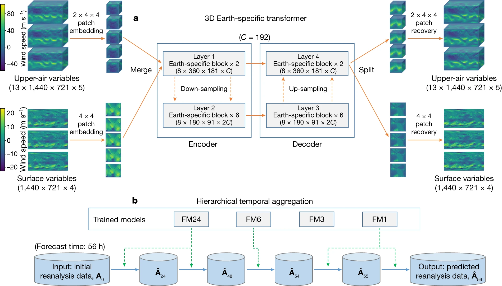
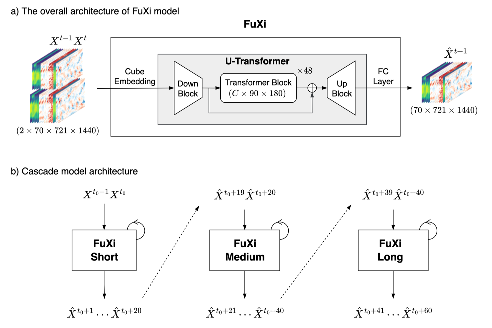

# WeatherLearn
<div align="center">

</div>
Implementation of the PyTorch version of the Weather Deep Learning Model Zoo.

## Dependencies
```
python = "^3.11"
torch = "2.1.0"
timm = "0.9.10"
numpy = "1.23.5"
```

## Model-zoo
### Pangu-Weather
#### Model Architecture

#### Example

```python
# Pangu
from weatherlearn.models import Pangu

import torch

if __name__ == '__main__':
    B = 1  # batch_size
    surface = torch.randn(B, 4, 721, 1440)  # B, C, Lat, Lon
    surface_mask = torch.randn(3, 721, 1440)  # topography mask, land-sea mask, soil-type mask
    upper_air = torch.randn(B, 5, 13, 721, 1440)  # B, C, Pl, Lat, Lon

    pangu_weather = Pangu()

    output_surface, output_upper_air = pangu_weather(surface, surface_mask, upper_air)

```

```python
# Pangu_lite
from weatherlearn.models import Pangu_lite

import torch

if __name__ == '__main__':
    B = 1  # batch_size
    surface = torch.randn(B, 4, 721, 1440)  # B, C, Lat, Lon
    surface_mask = torch.randn(3, 721, 1440)  # topography mask, land-sea mask, soil-type mask
    upper_air = torch.randn(B, 5, 13, 721, 1440)  # B, C, Pl, Lat, Lon

    pangu_lite = Pangu_lite()

    output_surface, output_upper_air = pangu_lite(surface, surface_mask, upper_air)

```
#### References
```
@article{bi2023accurate,
  title={Accurate medium-range global weather forecasting with 3D neural networks},
  author={Bi, Kaifeng and Xie, Lingxi and Zhang, Hengheng and Chen, Xin and Gu, Xiaotao and Tian, Qi},
  journal={Nature},
  volume={619},
  number={7970},
  pages={533--538},
  year={2023},
  publisher={Nature Publishing Group}
}
```
```
@article{bi2022pangu,
  title={Pangu-Weather: A 3D High-Resolution Model for Fast and Accurate Global Weather Forecast},
  author={Bi, Kaifeng and Xie, Lingxi and Zhang, Hengheng and Chen, Xin and Gu, Xiaotao and Tian, Qi},
  journal={arXiv preprint arXiv:2211.02556},
  year={2022}
}
```
### Fuxi
#### Model Architecture
  
#### Example  
```python
from weatherlearn.models import Fuxi

import torch

if __name__ == '__main__':
    B = 1  # batch_size
    in_chans = out_chans = 70  # number of input channels or output channels
    input = torch.randn(B, in_chans, 2, 721, 1440)  # B C T Lat Lon
    
    fuxi = Fuxi()  
    # patch_size : Default: (2, 4, 4)
    # embed_dim : Default: 1536
    # num_groups : Default: 32
    # num_heads : Default: 8
    # window_size : Default: 7
    
    output = fuxi(input)  # B C Lat Lon
```  
#### References
[FuXi: A cascade machine learning forecasting system for 15-day global weather forecast
](https://arxiv.org/abs/2306.12873)

Published on npj Climate and Atmospheric Science: [FuXi: a cascade machine learning forecasting system for 15-day global weather forecast
](https://www.nature.com/articles/s41612-023-00512-1)

by Lei Chen, Xiaohui Zhong, Feng Zhang, Yuan Cheng, Yinghui Xu, Yuan Qi, Hao Li

## TODO
- [ ] FengWu Model (https://arxiv.org/pdf/2304.02948v1.pdf)
- [x] FuXi Model (https://arxiv.org/pdf/2306.12873v3.pdf)  
- [x] Set a separate window_size for longitude and latitude in the Fuxi model.
- [ ] Add more unittest.
- [x] Infer the Pangu model using the pre-trained weights provided by the official Pangu repository.
